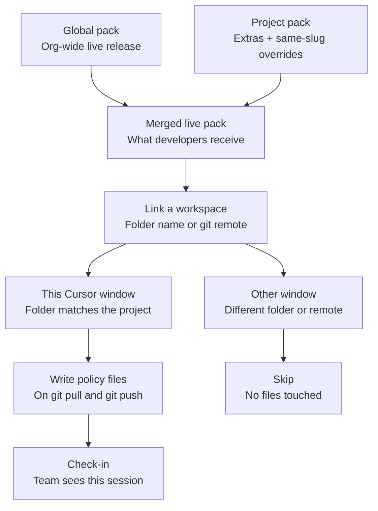

# RuleDeck

Manager-facing policy console. You author **rules, prompts, procedures, and tools**, version them, publish a live pack, and keep developer repos on that pack.

On a matching git checkout, RuleDeck writes Cursor, Claude Code, and GitHub Copilot files on **git pull / checkout** and again on **git push**. Developers consent once. Other folders on the same machine are left alone.

## How it works

A Cursor session is the folder you open. The live pack is global plus that project. Sync only writes in a linked workspace.



If the window is this RuleDeck repo, or any checkout that is not on the match list, hooks print skip and leave files alone. Do not install hooks here.

**Manager.** Publish the global pack once. Publish each project for extras. Same slug in a project overrides global for that team only. Developers never apply the global project directly — they join a team project and inherit global automatically.

**Developer.** Grant write access, name the folder or git remote, copy `.ruledeck` into that checkout, then `install-hooks` and `pull` there. Another Cursor window on another repo can link a different RuleDeck project — or none.

**After merge** (`post-merge`, `post-checkout`, `post-rewrite`): fetch the merged live pack and write Cursor / Claude Code / Copilot files into this working tree.

**Before push** (`pre-push`): write the same pack again and block the push if those files still need a commit.

## Quick start (Docker)

Requires Docker Desktop. Postgres is bound to `127.0.0.1:5433`. The UI is bound to `127.0.0.1:3000`.

```bash
chmod +x scripts/bootstrap-env.sh docker/entrypoint.sh
./scripts/bootstrap-env.sh
docker compose up --build
```

Open http://127.0.0.1:3000 and sign in with the accounts written to `.local-credentials` (gitignored).

The image does not bind-mount source. After you change code:

```bash
docker compose up --build -d
```

## What you get locally

Seed creates:

- **Global pack** (`/projects/global`) with a `coding-standards` rule
- **Platform API** (`/projects/platform-api`) with a PR review prompt, ship checklist, and GitHub MCP tool, published as `v1`
- A manager and a developer user (passwords only in `.local-credentials`)

Managers can create projects, edit the catalog, publish, and invite. Developers can browse, join, grant write access, and sync. They cannot publish.

## Developer: apply a pack to a real repo

Do this in the app you actually code in (folder name or git remote should match the project, e.g. `platform-api`), not inside this repository.

1. Sign in as the developer, open the project, and complete onboarding (platforms → allow writes → copy the kit).
2. Copy `output/<project-slug>/members/<user-id>/.ruledeck` into the repo root.
3. In that repo:

```bash
node .ruledeck/sync.mjs install-hooks
node .ruledeck/sync.mjs pull
```

4. Confirm Cursor/Claude/Copilot picked up the files, then `git pull` / `git push` once. Team shows the check-in.

If you change which folders count as that project, edit **Workspaces** in the UI (folder name and/or `owner/repo` remote).

Full detail: [docs/developer-sync.md](docs/developer-sync.md). Architecture: [docs/architecture.md](docs/architecture.md).

## Local Node (optional)

Needs Postgres matching `DATABASE_URL` in `.env`.

```bash
npm install
npx prisma generate
npx prisma db push
npx tsx prisma/seed.ts
npm run dev
```

## Generated files

| Platform | Rules | Prompts / procedures | Tools |
| --- | --- | --- | --- |
| Cursor | `.cursor/rules/*.mdc` | `.cursor/commands/*.md` | `.cursor/mcp.json` |
| Claude Code | `CLAUDE.md` | `.claude/commands/*.md` | `.mcp.json` |
| GitHub Copilot | `.github/copilot-instructions.md` | `.github/prompts/*.prompt.md` | `.vscode/mcp.json` |

Codex CLI, Windsurf, Cline, Continue, and OpenCode can be declared during onboarding. Pack files for those are not generated yet.

## HTTP sync API

Laptop runtime is zero-dependency `cli/sync.mjs` (copied into each kit). Authenticated with `Authorization: Bearer rds_…`.

| Method | Path | Purpose |
| --- | --- | --- |
| `GET` | `/api/v1/pack?project=<slug>` | Live files for this member |
| `POST` | `/api/v1/checkin` | Record a successful write |
| `GET` | `/api/v1/status?project=<slug>` | Compliance snapshot |

Tokens are hashed at rest. Rate limit is about 60 requests/minute per token.

## Security

See [SECURITY.md](SECURITY.md). Do not commit `.env`, `.local-credentials`, or `.ruledeck/credentials`.

## License

[MIT](LICENSE)
